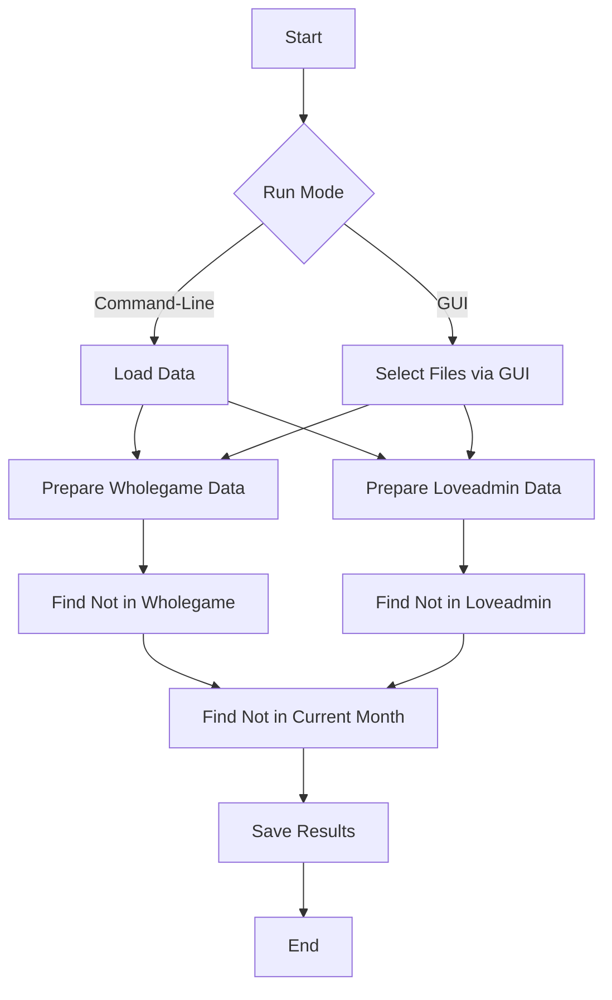
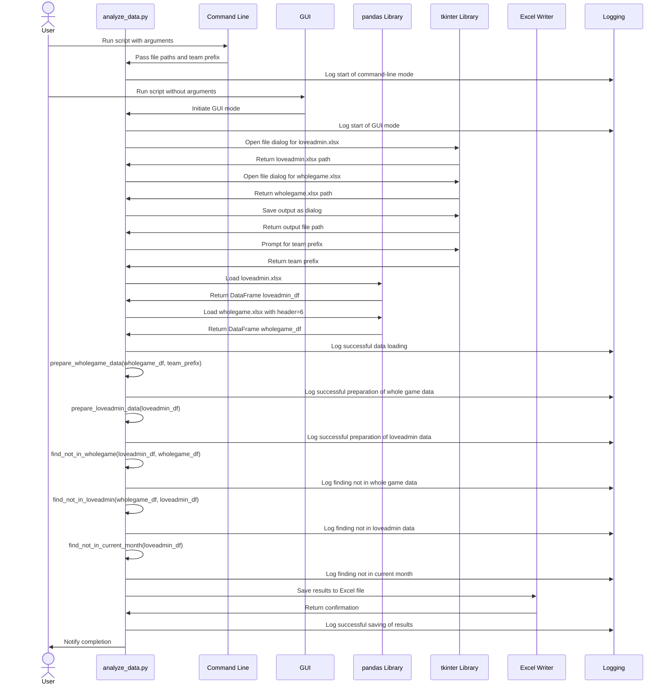
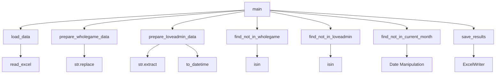

# Cross-Reference Analysis Script

This repository contains a Python script and a bash script designed to perform cross-referencing between two Excel datasets:

1. `loveadmin.xlsx` - Contains invoice data.
2. `wholegame.xlsx` - Contains player registration data.

## Features

- Identifies players/teams present in one dataset but not the other.
- Identifies players invoiced for the previous month but not the current month (invoice for July will be created in June).
- Saves the results into an Excel file with three sheets:
  - `Not in Wholegame`: Players/teams in `loveadmin.xlsx` not in `wholegame.xlsx`.
  - `Not in Loveadmin`: Players/teams in `wholegame.xlsx` not in `loveadmin.xlsx`.
  - `Not in Current Month`: Players invoiced for the previous month but not the current month.

## Requirements

- Python 3.x
- `pandas` library
- `openpyxl` library
- `tkinter` library
- `PyInstaller` (for creating a standalone executable)

## Setup

1. Install the required libraries:

```bash
    `pip install pandas openpyxl tk` 
```

1. Save the Python script to a file, for example, `analyze_data.py`.
2. (Optional) To create a standalone executable, use the provided bash script.

## Usage

### Command-Line Mode

Run the Python script with the required arguments:

```bash
`python analyze_data.py --loveadmin_file loveadmin.xlsx --wholegame_file wholegame.xlsx --output_file results.xlsx --team_prefix "Wilpshire Wanderers"` 
```

### GUI Mode

Run the Python script without arguments to use the GUI for file selection:

```bash
python analyze_data.py` 
```

### Create Standalone Executable

Use the provided bash script to create a standalone executable:

1. Save the bash script as `build_executable.sh`.
2. Make the script executable:

```bash
    `chmod +x build_executable.sh` 
```

3. Run the script:

```bash
    `./build_executable.sh -i icon.ico -n MyAnalyzer analyze_data.py` 
```

## Flow Diagrams

### Script Workflow



### Sequence Diagram



### Function Call Flow



## Notes

- Ensure that the `wholegame.xlsx` files have the first 6 rows as metadata. The script uses the `header=6` parameter in `pd.read_excel` to skip these rows.
- The `team_prefix` argument allows you to specify and remove the prefix from team names in the `wholegame.xlsx` file.

---

This README provides a comprehensive overview of the scripts, including setup instructions, usage examples, and visual flow diagrams to illustrate the workflow and function calls.
